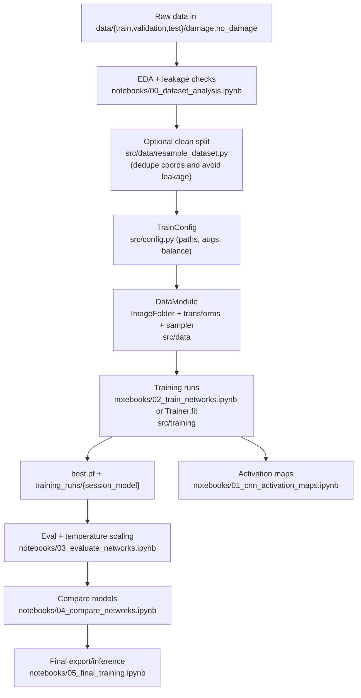

# IPEO: Hurricane Damage Detection

Binary classifier for post-hurricane satellite tiles (`damage` vs `no_damage`) with emphasis on calibrated probabilities.

## Environment
- Python 3.10 recommended.
- Install PyTorch/torchvision first (GPU example: `pip install torch torchvision --index-url https://download.pytorch.org/whl/cu118`; CPU: `pip install torch torchvision`).
- Then install extras: `pip install -r requirements.txt`.
- Add `src` to your `PYTHONPATH` (`export PYTHONPATH=$(pwd)/src`).

## Data
1) Download the ZIP from [Google Drive](https://drive.google.com/file/d/1vWwI8c0tx1DEq9fjeTU53inhhoVmoDYN/view?usp=sharing).
2) Unzip so you have:
```
data/
  train/{damage,no_damage}
  validation/{damage,no_damage}
  test/{damage,no_damage}
```
3) Optional cleaning (recommended to avoid leakage/duplicates):
- Coordinate grouping and leak-free split: `python src/data/resample_dataset.py --data-root data --output-root data_resampled --val-split 0.15 --test-split 0.15 --precision 1`
Point `TrainConfig.data_root` to the chosen cleaned directory; relative paths resolve from the repo root.

## Workflow (overview)



## Quick start (code)
```python
from config import TrainConfig
from training import Trainer

cfg = TrainConfig(
    data_root="data_resampled",  # or data
    model_name="resnet34",
    epochs=20,
    data_integrity_check=True,
    wandb_mode="disabled",
)
trainer = Trainer(cfg)
trainer.fit()
print(trainer.test())
```
Set `data_integrity_check=True` to log coordinate overlap and class counts by split during datamodule setup.

## Training details
- Config: `src/config.py` (`TrainConfig`, `build_config_from_dict`).
  - Data/augs: resize, flip, rotation, color jitter; dataset mean/std.
  - Imbalance: `balance_strategy` = `weighted_sampler` (sampler) or `class_weights` (loss).
  - Optimization: AdamW/SGD, cosine LR, label smoothing, grad clip, AMP, early stopping on `macro_f1`.
  - Logging/checkpoints: `checkpoints_dir` (best.pt) resolved from repo root, optional TensorBoard/W&B.
- Data loaders: `src/data/transforms.py`, `src/data/datamodule.py`.
  - ImageFolder, train/eval transforms, optional integrity summary of coord overlaps/conflicts when `data_integrity_check=True`.
- Models: `src/models/builder.py`, `src/models/custom.py`.
  - Backbones: resnet18/34/50, efficientnet_b0/b1/b2, convnext_tiny/small, or lightweight `custom_cnn`.
  - Head replacement to `num_classes=2` with optional dropout.
  - `_adapt_first_conv` copies pretrained conv1 weights into a new conv when `in_channels` differs (e.g., >3), avoiding random reinit.
  - `freeze_backbone=True` trains only the head (compare frozen vs fine-tune).
- Training loop: `src/training/trainer.py`.
  - Loss = cross-entropy + label smoothing (+ optional class weights).
  - Scheduler = cosine annealing; AMP + GradScaler; gradient clipping.
  - Early stopping on validation `checkpoint_metric`; stores best checkpoint; AMP enabled only when CUDA is available.

## Calibration and metrics
- Metrics (`src/validation/metrics.py`): accuracy, macro precision/recall/F1, Brier score (probability quality), ECE via reliability bins (calibration gap), plus reliability bin details.
- Temperature scaling (`src/validation/calibration.py`): fits scalar T on validation logits using LBFGS; saves `temperature.pt`. Applied as `logits / T` before softmax to improve calibration.
- Evaluation loop (`src/validation/evaluate.py`): collects logits/labels, computes metrics, supports optional temperature scaling at eval time.

## Notebooks
- `00_dataset_analysis.ipynb`: split/class counts, coordinate overlap/leakage checks, duplicates, spatial maps, augmentation previews.
- `01_cnn_activation_maps.ipynb`: loads trained checkpoints to visualize Grad-CAMs and activation patterns for interpretability.
- `02_train_networks.ipynb`: launches training runs across backbones with per-model overrides, writes configs/plots/summaries under `training_runs/{session}_{model}`.
- `03_evaluate_networks.ipynb`: evaluates val/test with optional temperature scaling, saves `eval_metrics.json` plus reliability/confusion/score plots.
- `04_compare_networks.ipynb`: aggregates evaluation outputs to compare accuracy/F1/calibration across models and sessions.
- `05_final_training.ipynb`: final targeted run using the selected recipe; exports best checkpoint and temperature for deployment.

## Repo map
- `src/config.py`: configuration objects and helpers.
- `src/data/`: transforms and datamodule (ImageFolder + sampler); leak-free resampling script (`resample_dataset.py`).
- `src/models/`: backbone builder + custom CNN.
- `src/training/`: training loop, checkpointing, early stopping.
- `src/validation/`: evaluation, metrics (Brier/ECE), temperature scaling.
- `src/utils/`: logging, reproducibility, checkpoint loader.
- `training_runs/`: outputs from notebook runs (configs, summaries, checkpoints, plots).
- `plots/`: saved figures from EDA and experiment notebooks.
